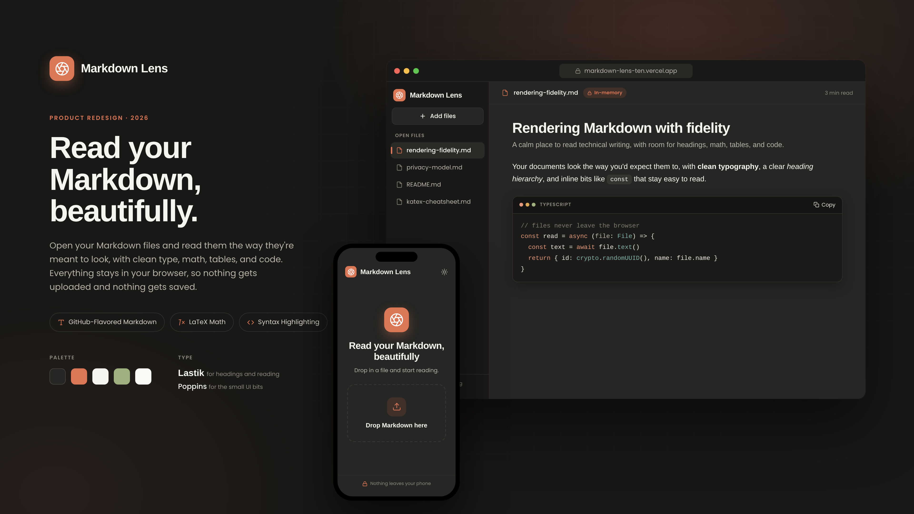

# Markdown Lens

A privacy-first, in-memory Markdown viewer. Drop in your `.md` files and read
them beautifully rendered, with Claude-like fidelity. Everything happens in your
browser: there is no backend, nothing is uploaded, and nothing is saved. Refresh
the tab and it is all gone by design.

<p align="center">
  
</p>

## Features

- Private by design: in-memory only, no backend, no storage of file content.
- Multi-file: upload several files and switch between them in the sidebar.
- GitHub-Flavored Markdown: tables, task lists, strikethrough, autolinks.
- LaTeX math with KaTeX, inline and block.
- Code blocks with a language label, syntax highlighting, and a copy button.
- Light and dark themes; the code block stays dark in both.
- Responsive down to mobile, with a slide-in file drawer.

## Tech stack

Vite, React 18, and TypeScript (strict). `react-markdown` with `remark-gfm`,
`remark-math`, `rehype-katex`, and `rehype-highlight`. Tailwind CSS with
`@tailwindcss/typography`, and `lucide-react` for icons.

## Run it

```bash
npm install      # install dependencies
npm run dev      # start the local dev server
npm run build    # produce the static production bundle (dist/)
npm run preview  # preview the built static bundle
npm run lint     # lint
```

The build is a static bundle: deploy `dist/` to any static host with zero
server cost.

## Accepted files

`.md`, `.markdown`, and `.txt`, up to 5 MB each. Duplicate names are
disambiguated rather than overwritten.

## Fonts

All fonts are self-hosted; nothing is loaded from a CDN.

- Reading and headings: Merriweather (self-hosted via `@fontsource`), with
  Lastik as a self-hosted fallback (bundled in `src/assets/fonts`).
- UI and chrome: Poppins.
- Code: the system monospace stack (`ui-monospace`, JetBrains Mono, Menlo).

## Live

[markdown-lens-ten.vercel.app](https://markdown-lens-ten.vercel.app/)
